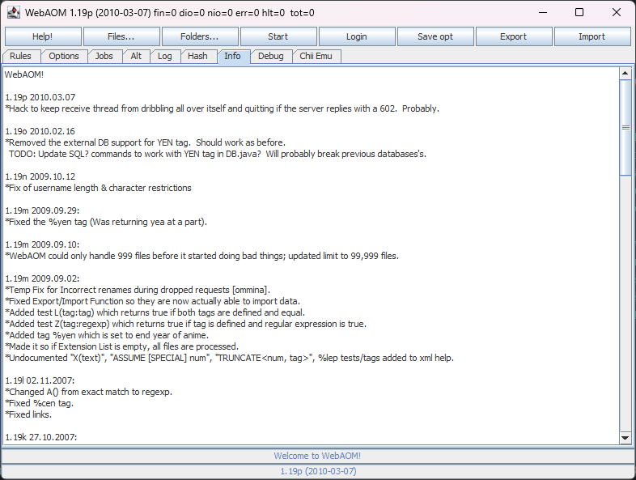

# WebAOM

This is an unmaintained fork. The original code is hosted at https://git.anidb.net/anidb/udp-clients/-/tree/master/webaom

`WebAOM` is a simple Java applet/application that hash files and add them to your [MyList](https://wiki.anidb.net/MyList) at `AniDB`. It is made for those who don't want to or cannot install `AniDB O'Matic`. The name may be inaccurate/misleading since it does not replace AOM in any way. It is based on the [UDP API Definition](https://wiki.anidb.net/UDP_API_Definition) and is therefore limited.



# HOWTO Step by step
## Register an AniDB account
WebAOM is of no use without an AniDB account. [Sign up](https://wiki.anidb.net/AniDB:Sign_up).

Ensure Java Runtime Environment is installed.

## Start WebAOM as applet or application

It might be more easy and convenient to start it as an applet, but I personally prefer the application. Use the jnlp link if you want to be sure to have the latest version of the application. You might want to try Ame if you have trouble with Java or don't want to install it. It covers the basic features of WebAOM, but is only for MS Windows and more buggy.

### Configure automatic renaming/moving (optional)

- Write the rules you want at ''Rules/Renaming/Moving'' or uncomment the default rule. Be sure to click ''Apply!'' when done.
- You most likely want to save your options after this. In that case click ''Save Opt''.
- [How to write rules.](#Move.2Frename_system)

### Select the files you want to process
- By clicking ''Files...''
- By clicking ''Folders...''
- By writing the path to a directory in the ''Options/Other/Hash Dirs'' field.
- By dragging and dropping files into the ''Job'' tab.
You will see the files you selected in the ''Job'' tab.

### Log on to the AniDB UDP API service
By clicking ''Login'' and providing your username and password. Encryption is optional and not really recommended. You'll need to set the API password in your profile options if you still want to use it.

### Click "Start" and go watch some anime
Click ''Start'' and WebAOM will for each file:
- Hash it.
- Use the hash sum to fetch meta data from AniDB.
- Add it to your MyList.
- Use the meta data to move and rename it.

## Documentation

### Buttons
- Help! : Open this wiki page.
- Files... : Add specific files for hashing. (Only those with extensions specified in "Wanted File Extensions" are added.)
- Folders... : Add folder(s) with all including files for hashing.
- Start/Stop : Start/stop hashing and moving (disk IO thread).
- Login/Log out: Log on/off the AniDB UDP Service (net IO thread).
- Save opt: Save options to "%home/.webaom".
- Export : Export all the loaded data to a file. (The filter settings in ''Alt'' applies!)
- Import: Import data from a file.
- Ping AniDB : Check reachability to the AniDB UDP server.

### Tabs
- Rules: Rule system. See [[WebAOM#Move/rename_system|Move/Rename system]].
- Options : All options.
- Jobs: Table of files/work.
- Alt: Alternative treetable view of your files. Grouped by anime, episode/group/folder, file.
- Log : History log. Press DEL to clean.
- Hash : All selected checksums are printed here.
- Info : Some info about the client.
- Debug : Low level communication and exceptions are printed here.
- Chii Emu: Write [[Chii]] commands here. (Also possible to use UDP API commands directly.)

### Options
- Connection
   - AniDB Host : URL to AniDB can be set here.
   - Remote Port : Remote Port can be set here.
   - Local Port : Local Port can be set here. Necessary if the default port is used by another application on your system.
   - Keep-Alive : Keep the connection to the server alive by pinging regularly. Check this if you're behind a nat router.
   - Delay (sec) : Delay between each datagram sent to server. 2 seconds is minimum, 3 is recommended. Should be set higher if connection is poor or if much work is queued.
   - Timeout (sec) : Timeout on receiving reply from AniDB.
- File Options
   - Add files to MyList.
   - [Filestates](https://wiki.anidb.net/Filestates)
   - [mylist:source](https://wiki.anidb.net/Mylist:source)
   - [mylist:storage](https://wiki.anidb.net/Mylist:storage)
   - [mylist:comment](https://wiki.anidb.net/Mylist:comment)
   - [mylist:watched](https://wiki.anidb.net/Mylist:watched)
- Other
   - Hash Dirs : Default directories to hash. Checked every time the hasher thread starts. Directories are separated with ";". It's not recommended to edit this string when the Hasher is running.
   - Browser Path : Set path to internet browser manually here. (For Linux users.)
   - My Database : JDBC URL to local / private database. See [Local Database](#Local_database).
   - Log File : Set path to log file (html). Press enter to enable.
   - Store password : Allow WebAOM to store your password (and API Pass) on disk. It will not be stored in cleartext.
   - Load DB on startup : Connect and load the database on startup.
   - Auto log : Start logging to disk automatically.
   - [Hash functions](http://en.wikipedia.org/wiki/Hash_function) : [ED2K](http://en.wikipedia.org/wiki/Ed2k_(hash)) [CRC32](http://en.wikipedia.org/wiki/CRC32) [MD5](http://en.wikipedia.org/wiki/MD5) [SHA1](http://en.wikipedia.org/wiki/SHA1) [TTH](http://en.wikipedia.org/wiki/Tiger-Tree_Hash)
- Wanted File Extensions : Default are avi, ogm, mkv, mp4.
- Rules (in own tab)
   - Renaming : Show rules for renaming.
   - Moving : Show rules for moving.
   - Apply : Apply the current rules. Don't forget to click this after you have changed the rules.
   - Replace Table : String mapping table. DELETE, CTRL UP/DOWN keys are supported.

### Job Menu (Popup)
The pop-up menu will appear when right clicking a job (or several). It will spawn a worker thread when needed. It's not possible to spawn several such worker threads, but it's possible to abort a running thread by pressing ESC.
- Pause : Pause / unpause job.
- Show Info : Show info about a file/job. (double click)
- Watch Now : Watch with default media player. Windows only. (alt + double click)
- Explore Folder : Open parent folder with Explorer. Windows only.
- Rehash : Use this if you want rehash and include other hash types. (Must be selected in 'Other' options.)
- Identify : Re-identify the file. Can be used on 'Unknown' files to check if they are added to AniDB.
- Add to MyList : Add file manually if you forgot to check 'Add files to MyList'.
- Remove from MyList : Remove file from MyList.
- Apply Rules : If the rules are changed after a job is finished, they can be applied again manually.
- Set Finished : If you don't want to bother with a troublesome file, just set it as finished.
- Restore Name : Rename file to its original name.
- Set Folder : Move file to a specific folder. Can also be used to find files when 'File not found'.
- Set Parent Folder : Same as 'Set Folder' but this will include the folder. For keeping the folder name.
- Edit Folder Path : Edit the folder path raw.
- Edit File Name : Edit the file name directly.
- Parse with avinfo : Extract metadata (codec, bitrate, etc.) from the file. The dll from [Avdump](https://wiki.anidb.net/Avdump) is required. Put it somewhere it will be found, like <tt>C:\Windows</tt>.
- Set fid (force) : Set the fid forcefully. For self edited and corrupted files. Not recommended.
- Remove from DB : Remove job from local database. This will _not_ remove the file from your MyList. The job will be re-added if used twice.

### Key mappings
In ''Job'' and ''Alt'' view:
| Key         | Operation                                                           |
| :---------- | :-----------------------------------------------------------------: |
| Enter/Space | Open file info window.                                              |
| A           | Open related anime page in browser.                                 |
| M           | Open related MyList page in browser.                                |
| N           | Open related MyList page (detailed) in browser.                     |
| G           | Open related group page in browser.                                 |
| F           | Open related file page in browser.                                  |
| E           | Open related episode page in browser.                               |
| K           | Open anime related ed2k export page in browser.                     |
| W           | Watch file with default media player (windows only).                |
| X           | Explore folder (windows only).                                      |
| C           | Parse selected file with [[Avdump]] (in cmd window) and then call F.|
| P           | Pause/unpause.                                                      |
| S           | Apply rules.                                                        |
| I           | Identify file.                                                      |
| F9          | Reset WebAOM. (Soft restart)                                        |


In ''Alt'' view only:
| Key         | Operation                                                           |
| :---------- | :-----------------------------------------------------------------: |
| F5          | Refresh view.                                                       |
| R           | Rebuild tree and refresh view.                                      |
| D           | Dump tree to ''Debug''.                                             |
| Right       | Expand node.                                                        |
| Left        | Collapse node.                                                      |

## Move/rename system

A new feature from 1.09 is moving and renaming of files based on rules. This is implemented to ease administration of your anime collection. The system may seem confusing at first, but it is actually pretty simple. Since the system performs virtually no error checking on the input you provide, it is recommended that you understand the system fully before using it. 

Notice that the system is under development. Feel free to request changes / comment.

### Scripting
For renaming and moving files WebAOM needs schemas. A schema is just a string with tags, where each tag corresponds to file/anime data. Ex: <tt>"%ann - %enr [%crc]"</tt>. (See [Tags](#Tags)) The point with the rule system is that you can customize these schemas so different types of files can be renamed different ways, and moved to different locations. To build the schemas you have to write two simple scripts; one for renaming and one for moving. Example on rename schema:

```
 IF A(Naruto) DO FAIL //Do not rename file if it is Naruto
 DO ADD '%eng (%ann) - %enr - %epn ' //Add the base, same for all files
 IF D(japanese);S(english) DO ADD '(SUB)' //Add (SUB) if the file is subbed in english
 IF D(japanese);S(none) DO ADD '(RAW)' //Add (RAW) if the file is not subbed.
 IF G(!unknown) DO ADD '[%grp]' //Add group name if it is not unknown
 DO ADD '(%CRC)' //Always add crc
 #this would create the schema "%eng (%ann) - %enr - %epn (SUB)[%grp](%CRC)" for a normal subbed file.
```

' around parts is not required. Example on move schema:

```
 IF R(DVD,HKDVD) DO ADD 'M:\dvd\'
 ELSE DO ADD 'N:\tv\'
 IF Y(0-1999) DO ADD '199X\%year - %ann [%eps]'
 ELSE DO ADD '%yea\%ann [%eps]'
 IF G(!unknown) DO ADD '[%grp]\'
 ELSE DO ADD '\'
```

Syntax for each line in a script:

```
[[ELSE] IF {test}/ELSE] DO ADD {part}/SET {part}/FAIL/FINISH [{last part}]/RETURN {complete schema}
```


| Element     | Meaning                                                             |
| :---------- | :-----------------------------------------------------------------: |
| ADD         | +=                                                                  |
| SET         |  = (assign)                                                         |
| FAIL        | return null                                                         |
| FINISH      | return result (possible to add last part, not needed as last line)  |
| RETURN      | return complete schema (for exceptions)                             |
| ,           | or                                                                  |
| ;           | and                                                                 |
| !           | not                                                                 |


Possible tests:

| Code | Type    | Meaning                                                                             |
| :--- | :------ | :---------------------------------------------------------------------------------: |
| A    | name/id | Anime id or name; romaji, kanji and english, but not synonyms and short names       |
| G    | name/id | Group id, name, short name or 'unknown'                                             |
| E    | text    | Episode number                                                                      |
| X    | text    | Total number of episodes                                                            |
| Q    | text    | Quality [unknown, very high, high, med, low, very low, corrupted, eyecancer]        |
| R    | text    | Rip source [unknown, camcorder, TV, DTV, VHS, VCD, SVCD, LD, DVD, HKDVD, www]       |
| T    | text    | Type [unknown, TV, OVA, Movie, Other, web]                                          |
| Y    | number  | Year                                                                                |
| D    | text    | Dub language (one of the audio tracks) [japanese, english, ...]                     |
| S    | text    | Sub language (one of the subtitle tracks) [japanese, english, ...]                  |
| P    | text    | File path [regexp](http://www.regular-expressions.info/reference.html)              |
| N    | text    | [Category](https://anidb.net/perl-bin/animedb.pl?show=genren) (one of)              |
| I    | text    | Tag is defined. Do not use %, i.e. I(eng) [eng, kan, rom, ...]                      |
| C    | text    | Codec (one of the audio/video tracks) [H264, XviD, MP3 CBR, ...]                    |
| U    | text    | Unequal tags. U(eng:ann) checks that both %eng and %ann are defined and unequal.    |
| L    | text    | Equal tags. L(eng:ann) checks that both %eng and %ann are defined and equal.        |
| Z    | text    | Equal tags with Z(tag:[regexp](http://www.regular-expressions.info/reference.html)) |

### Tags
Changed to three-letters-only in 1.18!

| Tag         | Replaced with                                                       |
| :---------- | :-----------------------------------------------------------------: |
| %ann        | Anime name; romaji                                                  |
| %kan        | Anime name; kanji                                                   |
| %eng        | Anime name; english                                                 |
| %epn        | Episode name; english                                               |
| %epk        | Episode name; kanji                                                 |
| %epr        | Episode name; romaji                                                |
| %enr        | Episode number                                                      |
| %grp        | Group short name                                                    |
| %ed2 / %ED2 | ed2k sum (lower/upper)                                              |
| %md5 / %MD5 | md5 sum (lower/upper)                                               |
| %sha / %SHA | sha1 sum (lower/upper)                                              |
| %crc / %CRC | crc sum (lower/upper)                                               |
| %ver        | Version string                                                      |
| %inv        | Invalid crc string                                                  |
| %cen        | Censored string                                                     |
| %dub        | Dub language (tracks separated with ')                              |
| %sub        | Sub language (tracks separated with ')                              |
| %vid        | Video codec (tracks separated with ')                               |
| %aud        | Audio codec (tracks separated with ')                               |
| %qua        | Quality                                                             |
| %src        | Source                                                              |
| %res        | Resolution                                                          |
| %yea        | Year                                                                |
| %eps        | Total number of episodes                                            |
| %typ        | Type [unknown, TV, OVA, Movie, TV Special, Other, web]              |
| %gen        | Category string                                                     |
| %fid        | File ID                                                             |
| %aid        | Anime ID                                                            |
| %eid        | Episode ID                                                          |
| %gid        | Group ID                                                            |

